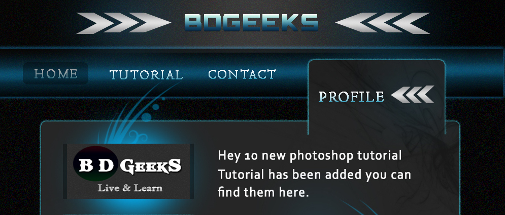

Hello everyone,

Today is Monday, 17th of November 2019. A perfectly rainy and a cosy day to start the #100DaysOfCode challenge that was originally created by <a href="https://twitter.com/ka11away?ref_src=twsrc%5Egoogle%7Ctwcamp%5Eserp%7Ctwgr%5Eauthor" target="_blank">Alexander Kallaway.</a> If you are interested, you can read more about the creator and the history behind #100DaysOfCode <a href="https://www.freecodecamp.org/news/the-crazy-history-of-the-100daysofcode-challenge-and-why-you-should-try-it-for-2018-6c89a76e298d/" target ="_blank">here</a>. 
--- 

# So who am I?

I am a 27 year old female who has done Bachelors in Biomedical Science (BMS) and masters in Haematology & Transfusion Science (basically the study of diseases related to blood) from Middlesex University, London. Besides studying, I started learning Photoshop back in 2012 or 2013 as a hobby. First I started playing around with the options, tools and layers followed by filters & layer styles. Learned how to create amazing text effects by following step by step tutorials from Youtube and then started designing BDGEEKS using Photoshop which I will explain in details in the next section. Currently changing my career from BMS to UI/UX design and also learning how to code. 

# why the change in career? 

So you may wonder if I have studied Biomedical Science, then why did I change my career into UI/UX design. The story is long but the short answer is **Flexibility** & **Freedom**. Career in my chosen field made me feel extremely restrained as I had to be physically present in every interviews, work day/night shifts in a freezing room temperature and follow standard dress code. 

# And why particularly UI/UX? 

To answer this I have to go back to 2011, when my awfully smart husband: [Foysal Ahamed](https://foysal.it/) first started learning how to code. After sometime of learning the basics, he built a website on his own called BDGEEKS in 2013 where he would upload programming related tutorials in Bengali but he did not line the interface of the website. This is where I jumped in and helped him out by trying to design a website for him. And guys check out this masterpiece I have built for him back in 2013: 

After that, he continued learning, building and working on projects while I moved onto product designing. I uploaded a few business cards and brochures from 2013 to 2014 [Graphic River](https://graphicriver.net/user/hexkode/portfolio). And again all of this was just out of curiosity and time pass. I did not have any intention of making this a career back then. In 2015, I got caught up with the thesis, coursework and exams of my final year of bachelors. 

[Foysal](https://www.codementor.io/foysalit) then moved into mobile app development and together we have built [Jarme](https://jarmemori.es): a colourful diary app and [Naao](https:naao.delivery): a crowdsourced package delivery app both of which are currently available on Android and iOS. I really enjoyed working on both of this projects with Foysal and it finally made me realise that this is something I want to build my career on. 

# The reason behind learning to code

When designing Jarme and Naao I have realised that my lack of knowledge in what can and can't be built with a programming language was making it extremely difficult for Foysal to build the apps especially Jarme. My design for Jarme was inconsistent and did not follow any design system library. I was also designing components that were a bit unrealistic in terms of programming and even if there was a time consuming way of coding it, the app would end up buggy and slow. Foysal and I were arguing a lot as I was in the impression that he was not liking my designs while in reality the designs were actually very unrealistic to begin with. Hence why I have decided to learn more about programming which will improve my design thinking a lot more and reduce the conflict between the designer and the developer.

--- 
# So what have I learnt today? 

# 1. BLOG 

The blog section of my portfolio did not exist till today. With a lot of help from Foysal and [Gatsby](https://www.gatsbyjs.org/), I have finally got it up and running. Playing around with the blog and this post will also be part of my #100DaysOfCode challenge.

# 2. TERMS

Developers use a lot of terms in blogs or twitter that I am unfamilier with so I have decided to google a few terms and understand what they meant. 

### Domain & Servers 
---

**Domain** is the name of the address of a website. For example, https://www.facebook.com. Its like having a phone number for your mobile. Without the mobile number no one knows where to call you or find you. 

**Servers** Server is like a piece of land you buy or rent out to live in. It does not necessarily mean you have a home with beautiful furnitures. But when you do have a beautiful home with furnitures, you have a land where you can put it onto. If that makes sense! 

Also do you know what **Favicon** is?

**Favicon** - Favicon is the small icon that appears on the tab of the browsers. 

### Caches & Cookies 
---

**Cache** - When a visitor repeatedly visits the same website, cache stores certain elements for the user to reduce the loading time of the website.

**Cookies** - Cookies on the other hand saves information such as password, visiting date & time, IP address, browser for a short period of time and sends this information back to the server when the user revisits the next time. This allows the site to represented data that suits your needs in a more convenient way.

# Front-End development VS Back-End development
---

**Front-end** - In front end development is coding the part that is visible to the users. For example, menu, buttons, cards etc.

**Back-end** - Back-end development is mostly the server side of the programming where the developers work with databases and its also not visible to the users. 
