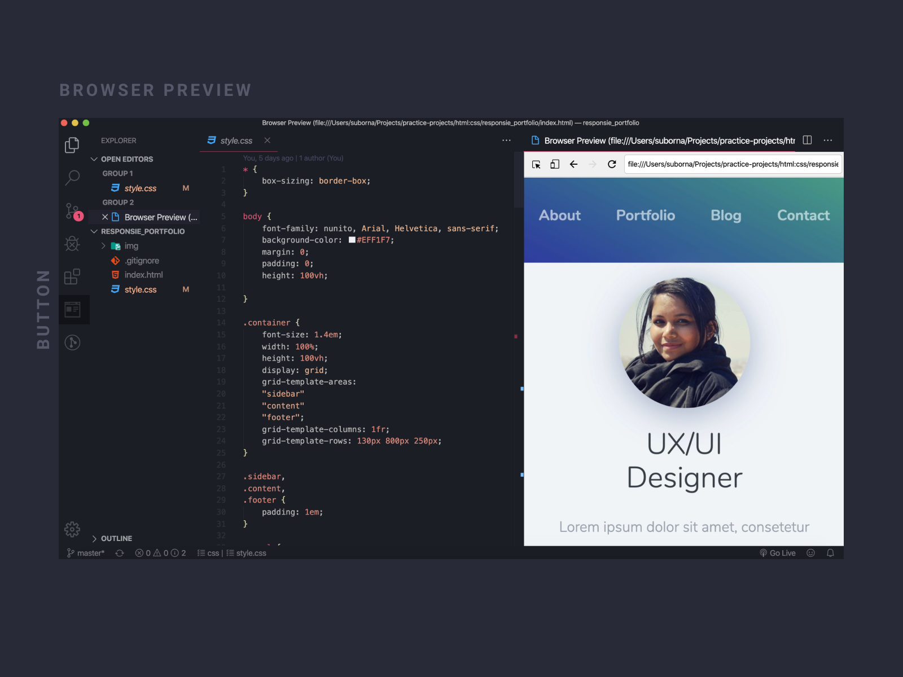
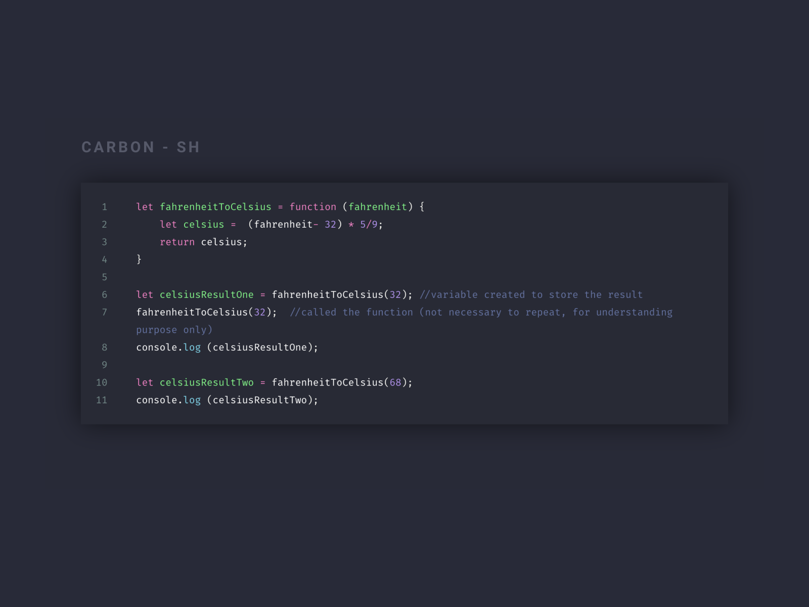
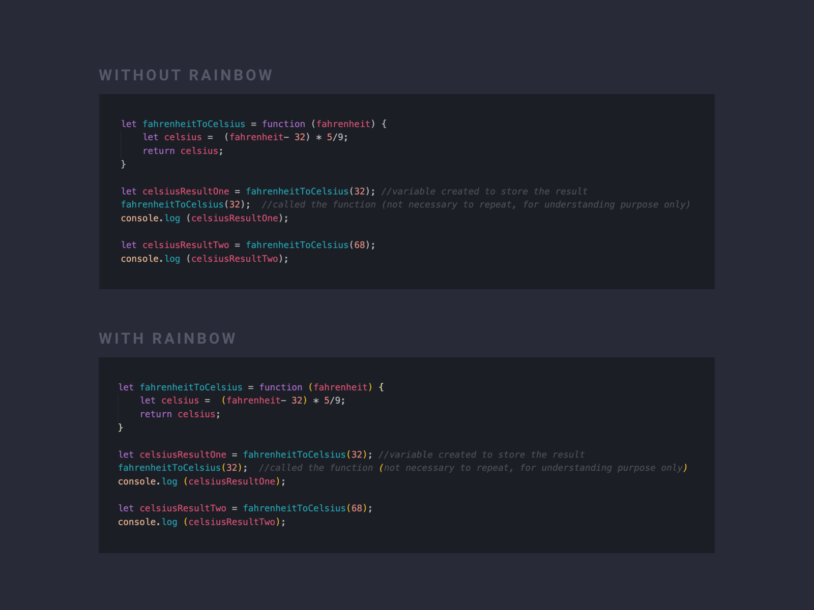
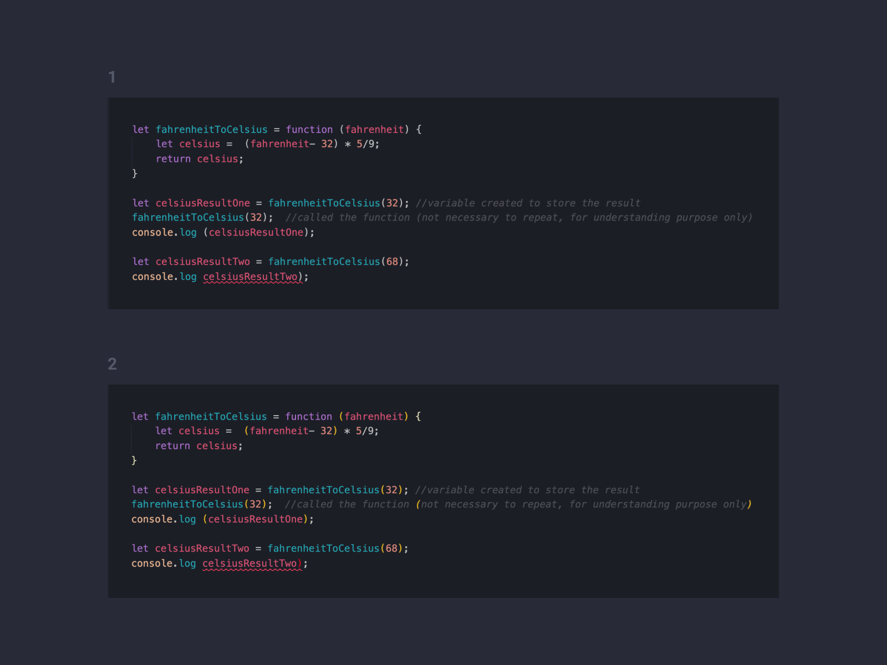
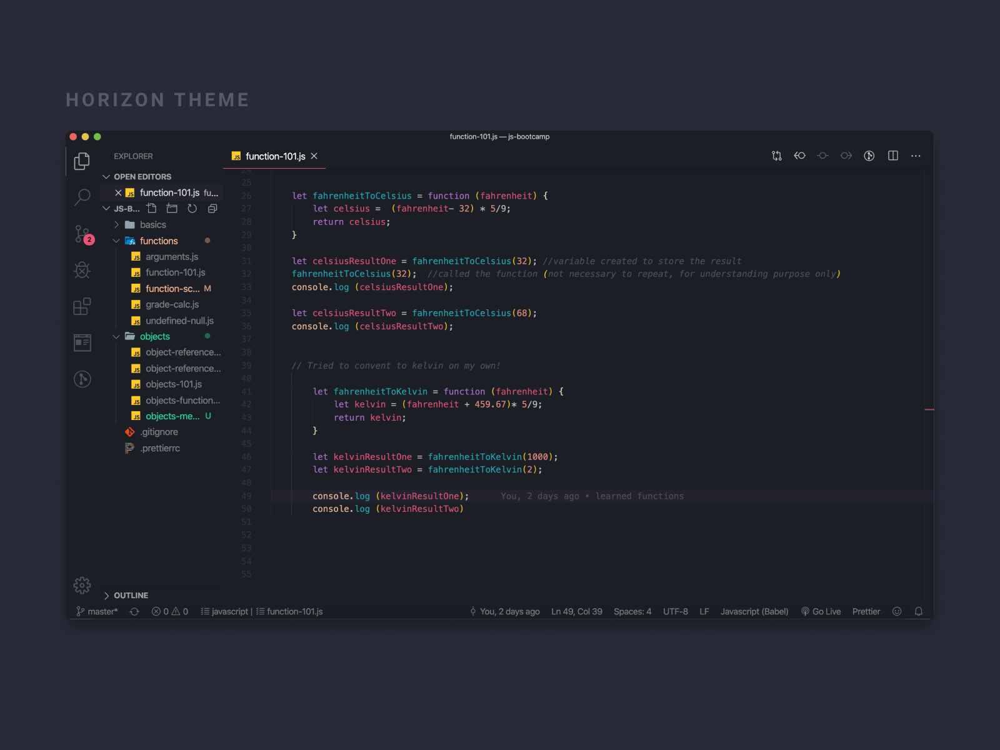
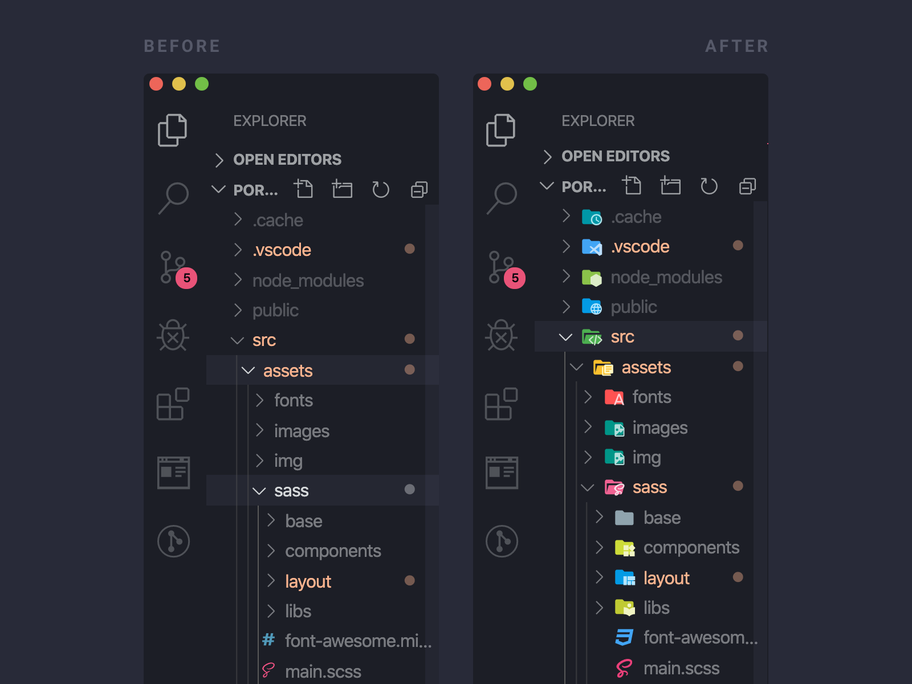

I have started coding very recently (about 1-2 months) and have been using Visual Studio (VS) code as my primary code editor since day 1. VS code is currently available on all major operating systems: Windows, Linux and macOS and if you are not familiar with it and would like to know a bit more, then click [here](https://code.visualstudio.com/docs).

VS code as well as the plugins I mentioned below was recommended to me by my husband [Foysal](https://www.codementor.io/foysalit) who has 8 years of experience in full stack development. He had other plugin recommendations too but I, as a codeNewBie did not feel the need of those plugins just yet. The plugins below not only made my life as a codeNewBie a lot easier but it also allowed me get things done quicker in a less frustrated way as well as made my editor feel more like a home I decorated myself.  

### Plugin 1 - Live Server

I found this plugin incredibly helpful when working with HTML & CSS especially when I try to, suppose: practice building a webpage or a sign-up form. It runs a web server for you and gives you a browser accessible localhost address and will automatically refresh the browser every time you update the code on your code editor so you don't have to manually click on the refresh button. 

Link: [Live Server](https://marketplace.visualstudio.com/items?itemName=ritwickdey.LiveServer)

### Plugin 2 - Browser Preview

This plugin is particularly helpful when you don't want to go back and forth from editor to browsers such as Chrome or Firefox to check the changes you have made in your code. After installing the plugin it will create it's own button on the side menu and when the button is clicked the editor will split and a browser will open on the right hand side.

Also do not forget to open the html file on browser, copy the file path link and paste it onto the preview browser. If live server is installed, copy the localhost link and paste it onto the browser to get live updates. 

If this section confuses you please feel free to get in contact with me via [Twitter](https://twitter.com/suborna00). I will be happy to tell you more in details.

Link: [Browser Preview](https://marketplace.visualstudio.com/items?itemName=auchenberg.vscode-browser-preview)

### Plugin 3 - Carbon-now-sh

Since I am currently working towards the #100DaysOfCode challenge on twitter, I often share a screen shot of my code together with the updates of my everyday progress until I found this plugin. This plugin allows you to create beautiful images of your code and directly share it on twitter. In order to use it:

- Install the plugin
- Select the lines of code you would like to share
- Press [option + cmd + a] which will take you to a browser where you can edit the code however you like.

If you are like me and you struggle to remember shortcuts, then do the follow below: 

- Press [cmd + shift + p] to open up the VS code terminal  
- Type carbon, and just click on the highlighted selection of carbon which will then take me to the browser. 

Link: [Carbon-now-sh](https://carbon.now.sh/)

### plugin 4 - Code Spell Checker

This plugin underlines any mistakes I have made in my code which might end up causing an error. Instead of going through the code and figuring out myself what might be causing the error, I can just skim through the code very quickly to see if any of my code is underlined before I look for the other reasons why my code might not be working as it should.

Link: [Code Spell Checker] (https://marketplace.visualstudio.com/items?itemName=streetsidesoftware.code-spell-checker)

### plugin 5 - Rainbow Brackets

I find this plugin particularly helpful when playing around with JavaScript. Mainly because JavaScript coding requires the use of brackets a lot. This plugin allows me visualise the brackets a lot better and highlights the end bracket of a code block if the bracket of the beginning code block is missing or accidentally removed (ref: second image). 

Link: [Rainbow Brackets](https://marketplace.visualstudio.com/items?itemName=2gua.rainbow-brackets)

# optional
----
### plugin 6 - Theme 

If you are someone like me who spent like a whole day playing around with themes, installing and uninstalling to make the codes look more colourful and presentable 😛 (I know I know I am crazy!) then here are a few I would suggest: 

1. [Horizon](https://marketplace.visualstudio.com/items?itemName=jolaleye.horizon-theme-vscode) - This one is my current favourite one at the moment.

2. [Dracula](https://marketplace.visualstudio.com/items?itemName=dracula-theme.theme-dracula) 
3. [Ayu](https://marketplace.visualstudio.com/items?itemName=teabyii.ayu) 
4. [Noctis](https://marketplace.visualstudio.com/items?itemName=liviuschera.noctis)
5. [Material theme](https://marketplace.visualstudio.com/items?itemName=Equinusocio.vsc-material-theme)

### plugin 7 - Icons

I am currently using [Material Theme Icon](https://marketplace.visualstudio.com/items?itemName=PKief.material-icon-theme) which changes the current file icons to material theme icons. I feel like these icons are a lot more representable, highly contrasted and eye catching! But you can explore other icon packs too from the extensions too. 

