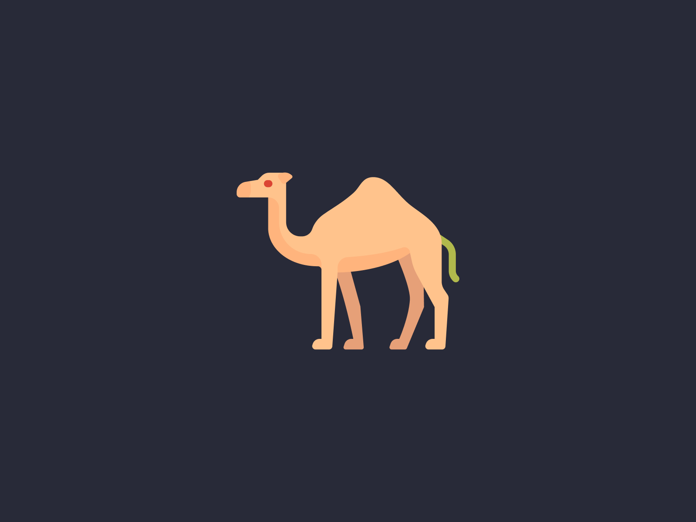
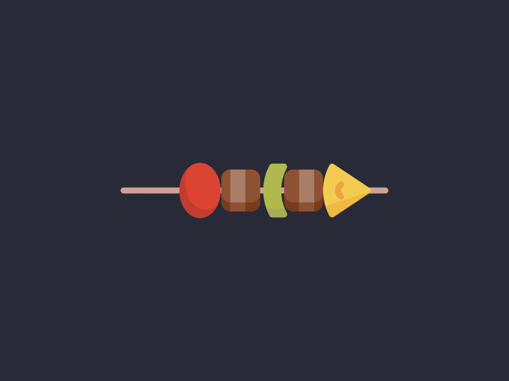
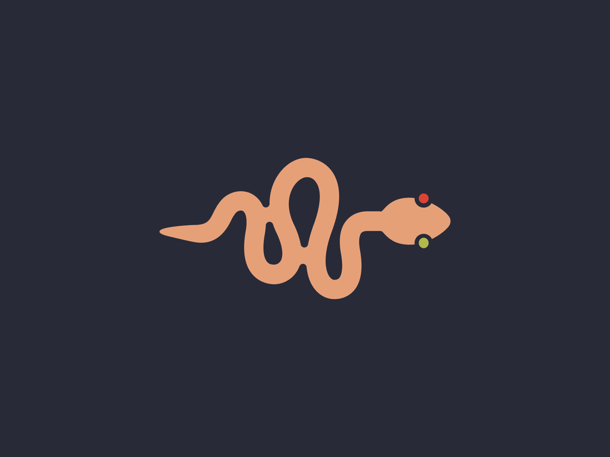

Casing is such an important idea in programming that languages usually include various case conversion functionality out of the box. Such as `.toLowerCase()` or `.toUpperCase()` in JavaScript. 

As I have mentioned before I am very new to programming, it's only been more than a month and within this period I have been practicing HTML, CSS and the basics of JavaScript and I have come across new casing terminologies that I have never heard before and would like to share them with other code newbies.

While learning JavaScript I have seen programmers use different types of casing in order to name their variables, functions and file names but I did not know they had specific names. Here is what I have discovered recently about casing:

**PascalCase** 

In PascalCasing, all the words used to name a variable or a function starts with capital letters. For example:

- ThingsToDo
- MoviesWatched
- FoodsSoldToday

**camelCase**

In camelCasing, the first letter of the word is always small letter and the rest of the words are always capital letter. so for example:

- thingsToDo
- moviesWatched
- placesToGo

**kebab-case**

In kebab-casing, every word will be followed by a hyphen with all small letters. I believe the name comes from how a stick in inserted through a shish kebab. Usually you wouldn't be able to use kebab-casing for variables and functions. For example: 

- things-to-do
- places-to-go
- movies-to-watch

**snake\_case** 

In snake_casing the cases will have an underscore after each word which would look like a snake walking or a snake just snaking around. Examples would look like the following: 

- things\_to\_do
- places\_to\_go
- movies\_to\_watch

