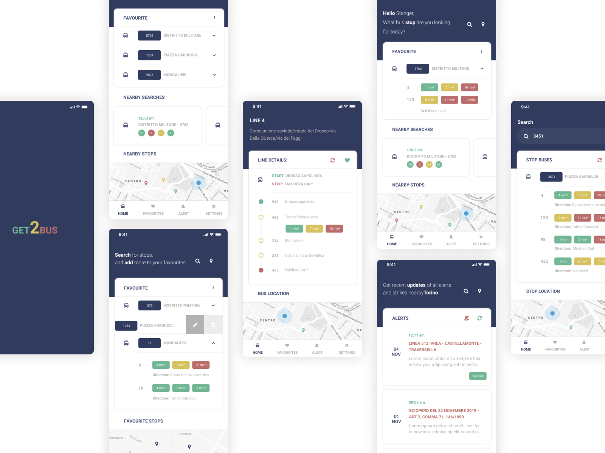

I have finished the "responsive web design principles" on [freecodecamp](https://www.freecodecamp.org/suborna) and instead of continuing with the coding, I have decided to work on some designing instead. Finally managed to finish the GTT bus app redesign project I have been doing for quite some time and uploaded it on [UpLabs](https://www.uplabs.com/posts/bus-app-concept-6f26fa4b-633d-455c-967c-b957dbef8232).

Overall it wasn't a productive day for coding but I am glad I took a break and worked on Figma for a change. 