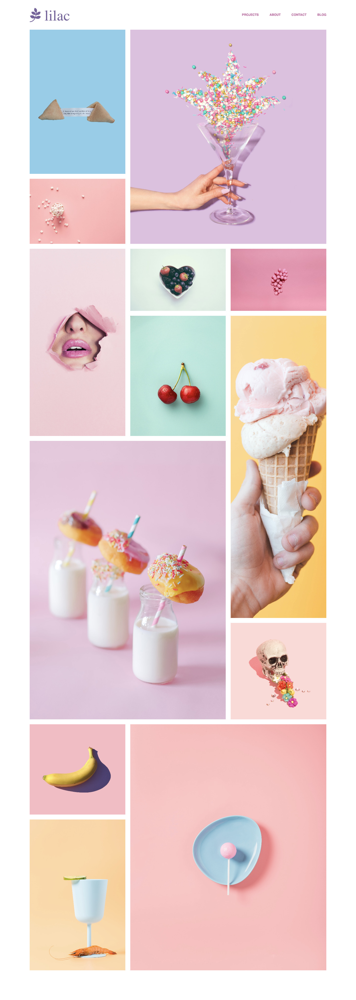

So yesterday I have spent some time playing around with CSS Grid and today decided to work on a project to understand the concept a little better. I have found a really cool tutorial on Youtube by [sweetdev](https://www.youtube.com/watch?v=YnYdwezNjNg). I have named the project **lilac** and used all the pictures from [Unsplash](https://https://unsplash.com/). Below are some codes which I have used to apply the grid on Lilac: 

``` css
.grid {
    width: 100%;
    height: auto;
    display: grid;
    grid-gap: 20px;
    grid-template-columns: repeat(3, 1fr);
    grid-auto-rows: minmax(220px, auto);
    margin-bottom: 60px;
}

.grid-item {
    background-color: #ddd;
}

.grid-item > img {
    width: 100%;
    height: 100%;
    object-fit: cover;
}

.grid-two {
    grid-column: 2 / 4;
    grid-row: 1 / 3;
}

.grid-four {
    grid-row: 3 / 5;
}

.grid-eight {
    grid-row: 4 / 6;
    grid-column: 3 / 4;
}

.grid-nine {
    grid-row: 5 / 7;
    grid-column: 1 / 3;
}

.grid-twelve {
    grid-row: 7 / 9;
    grid-column: 2 / 4;
}
```

